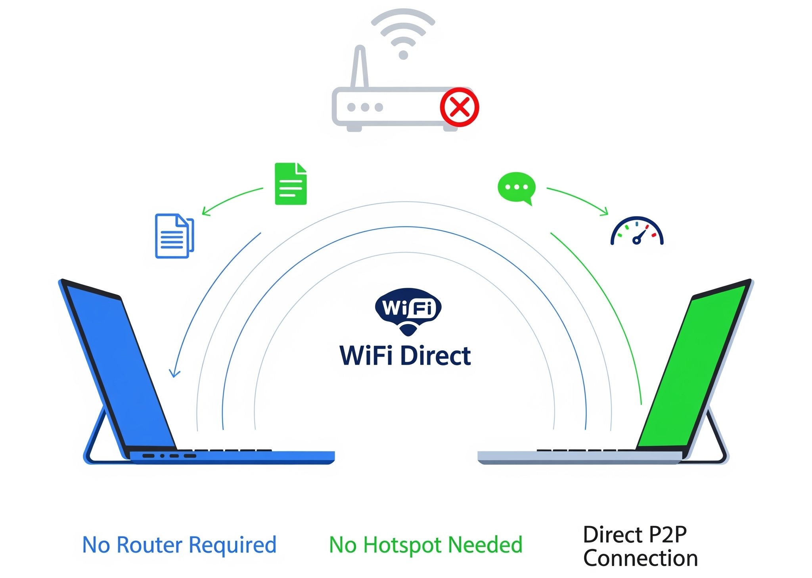
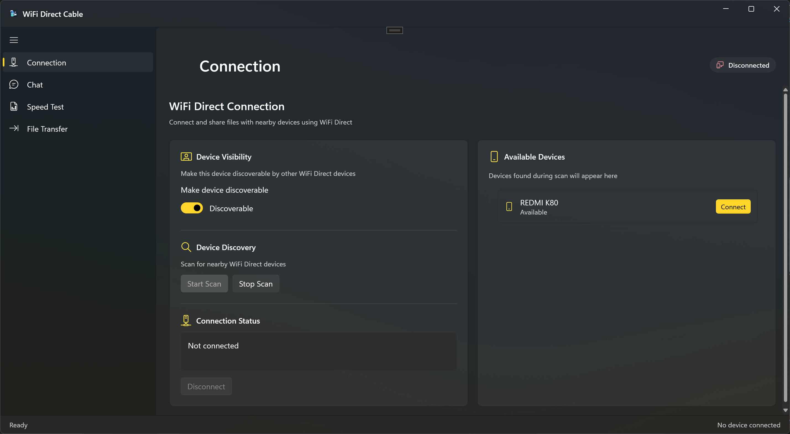
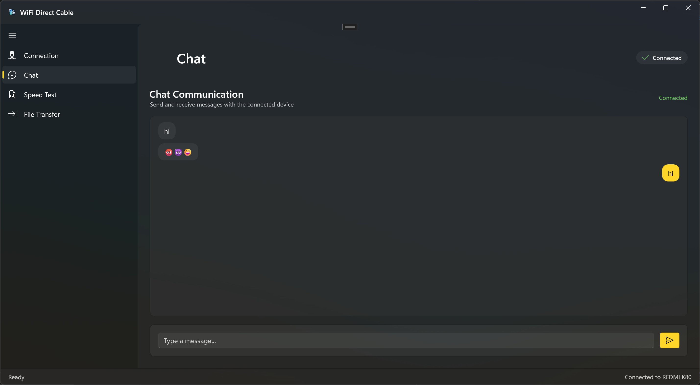
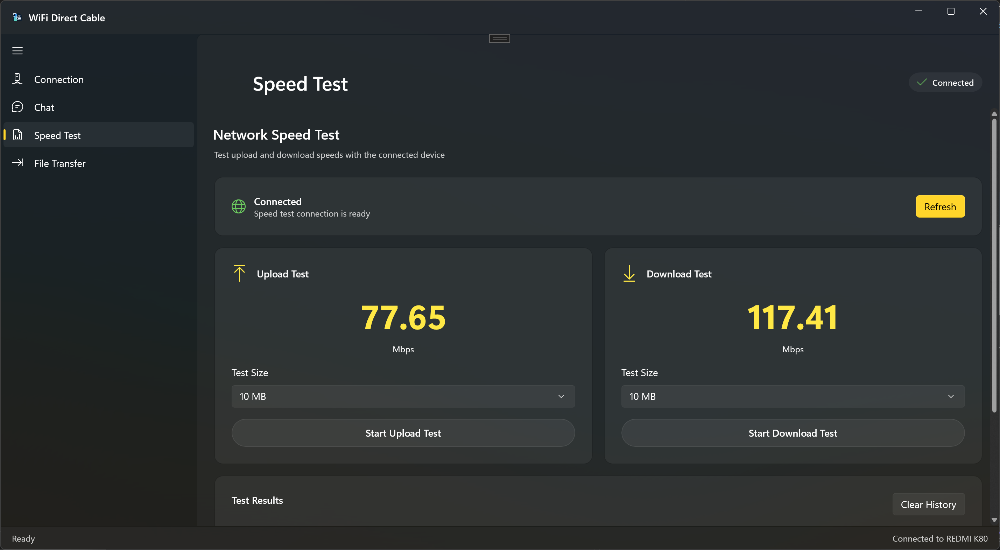
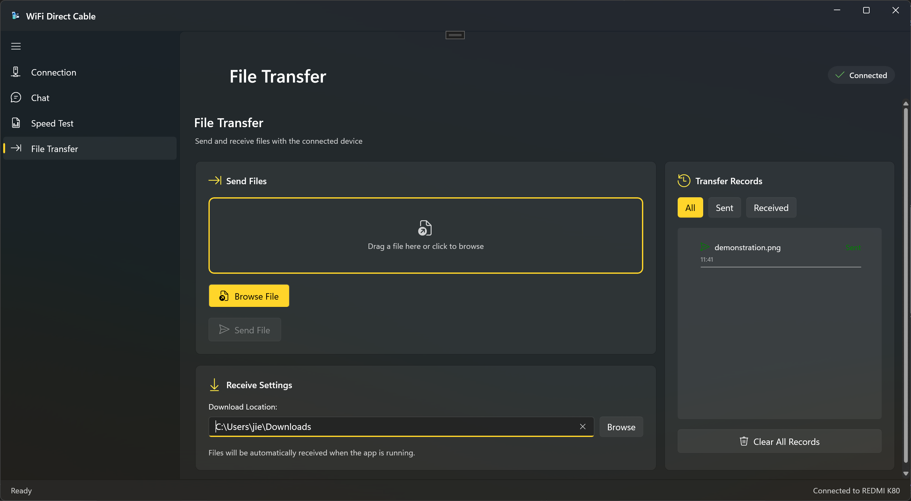

# WDCable for Windows



*Seamlessly transfer files between devices without requiring a router or existing network*


**WDCable** is a powerful application that allows you to transfer files, messages, and data between devices using Wi-Fi Direct. This means you don't need a router, hotspot, or any existing network infrastructure. It's designed to be fast, stable, and easy to use.

This repository contains the Windows version of WDCable, built with WinUI 3 for a modern and native user experience.

## 📸 Screenshots

| Feature | Screenshot |
| :---: | :---: |
| **Connection** |  |
| **Chat** |  |
| **Speed Test** |  |
| **File Transfer** |  |

## ✨ Features

*   **Direct Device-to-Device Communication**: Leverages Wi-Fi Direct to create a direct connection between your devices.
*   **High-Speed Data Transfer**: Enjoy faster transfer speeds compared to traditional methods that rely on a central network.
*   **File and Message Sharing**: Seamlessly send files and chat messages between connected devices.
*   **Network Speed Test**: Includes a tool to measure the transfer speed between your devices.
*   **Modern Windows UI**: Built with the latest WinUI 3 framework for a clean and intuitive interface.

## 🚀 Getting Started

To get started with WDCable for Windows, you can either build the project from the source or download the latest release.

### Building from Source

1.  Clone this repository:
    ```sh
    git clone https://github.com/your-username/WDCableWUI.git
    ```
2.  Open `WDCableWUI.sln` in Visual Studio.
3.  Build and run the project.

## 📱 Android Version

An Android version of WDCable is also available, allowing for cross-platform data transfer. You can find it here: [WDCable for Android](https://github.com/jingcjie/WDCable_flutter).

## 🛠️ Built With

*   [.NET 8](https://dotnet.microsoft.com/)
*   [Windows App SDK](https://docs.microsoft.com/en-us/windows/apps/windows-app-sdk/)
*   [WinUI 3](https://docs.microsoft.com/en-us/windows/apps/winui/winui3/)

## 📄 License

This project is licensed under the terms of the license specified in the `LICENSE` file.