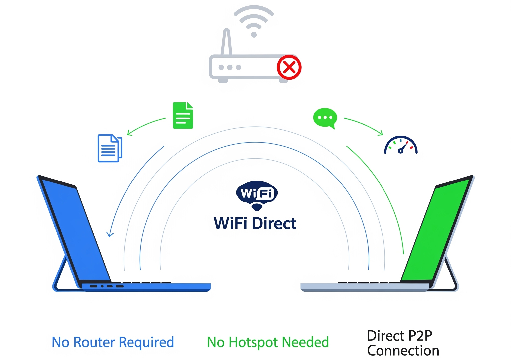
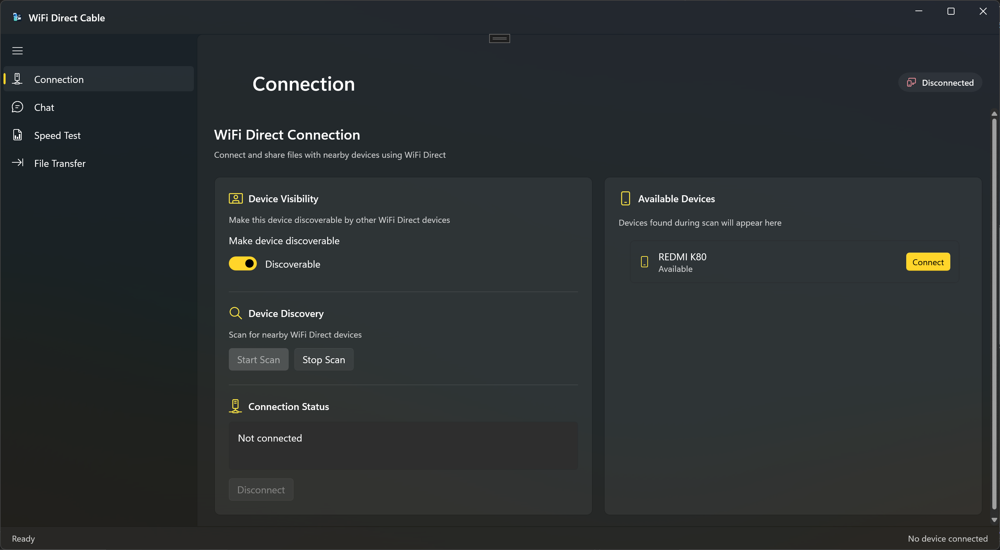
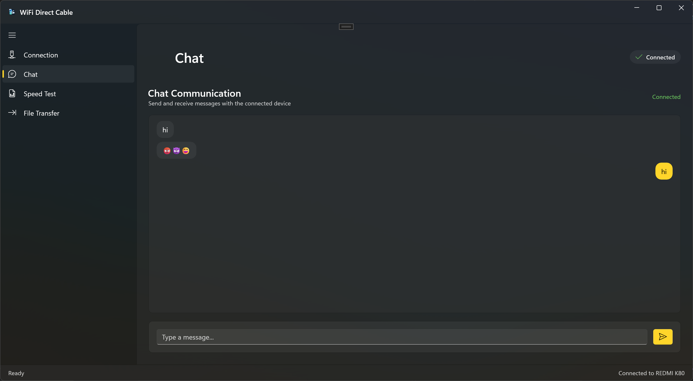
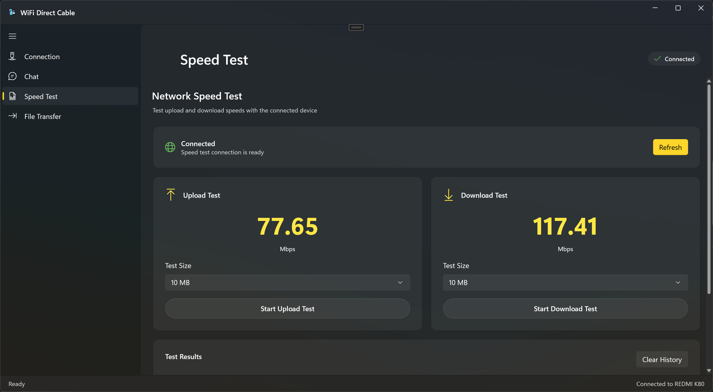
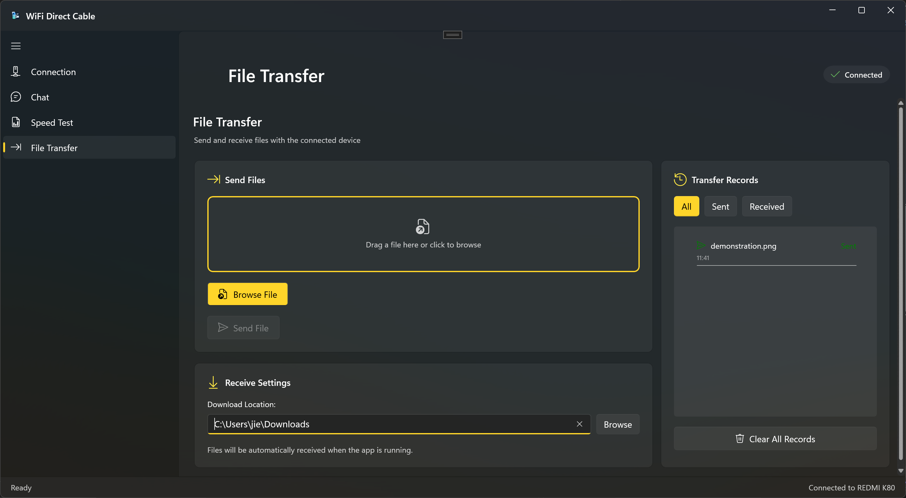

# WDCable for Windows



*Seamlessly transfer files between devices without requiring a router or existing network*


**WDCable** is a powerful application that allows you to transfer files, messages, and data between devices using Wi-Fi Direct. This means you don't need a router, hotspot, or any existing network infrastructure. It's designed to be fast, stable, and easy to use.

This repository contains the Windows version of WDCable, built with WinUI 3 for a modern and native user experience.

## 📦 Download

<a href="https://apps.microsoft.com/store/detail/9MZQMRHFFJJW?cid=DevShareMCLPCS">
  
</a>

*Available now on the Microsoft Store for Windows 10 and Windows 11*

## 📸 Screenshots

| Feature | Screenshot |
| :---: | :---: |
| **Connection** |  |
| **Chat** |  |
| **Speed Test** |  |
| **File Transfer** |  |

## ✨ Features

*   **Direct Device-to-Device Communication**: Leverages Wi-Fi Direct to create a direct connection between your devices.
*   **High-Speed Data Transfer**: Enjoy faster transfer speeds compared to traditional methods that rely on a central network.
*   **File and Message Sharing**: Seamlessly send files and chat messages between connected devices.
*   **Network Speed Test**: Includes a tool to measure the transfer speed between your devices.
*   **Modern Windows UI**: Built with the latest WinUI 3 framework for a clean and intuitive interface.

## 📱 Android Version

An Android version of WDCable is also available, allowing for cross-platform data transfer. You can find it here: [WDCable for Android](https://github.com/jingcjie/WDCable_flutter).

## Audio Link Status

The shared post-Wi-Fi-Direct protocol is documented in `../PROTOCOL.md`. Audio Link v1 is app-contained: one peer starts `Receive`, the other starts `Send`, and Opus audio flows over an optional session-owned `audio` transport negotiated after the base session is `Ready`.

WinUI has an Audio page and Windows audio runtime. Android send captures microphone audio. Windows send captures default system output through WASAPI loopback so Android can act as the Windows speaker. For compatibility with the current Android receiver, Windows still sends `source: "microphone"` in `audio.offer` metadata even though the local source is system audio. Keep raw TCP ownership inside `SessionManager` and transport adapters; feature code should use session APIs and control messages.

WinUI Audio Link work should mirror Android v1:

*   Receiver must explicitly start receive mode before accepting an offer.
*   The group owner listens on an ephemeral audio port and sends `audio.transport`; the client connects, regardless of which side sends audio.
*   Audio errors use `audio_*` control error codes and must not fail the base session.
*   v1 supports one active stream per session, Android microphone input, Windows system-audio input, in-app playback, Opus, mono 48 kHz, 20 ms packets, and 24 kbps target bitrate.
*   Android sends Opus codec-configuration frames before normal audio packets using `audio.frame` metadata `codecConfig: true`; the Windows decoder path must consume that initialization before playback.

## 🚀 Getting Started

To get started with WDCable for Windows, you can either build the project from the source or download the latest release.

### Building from Source

1.  Clone this repository:
    ```sh
    git clone https://github.com/jingcjie/WDCableWUI.git
    ```
2.  Open `WDCableWUI.sln` in Visual Studio.
3.  Build and run the project.


## 🛠️ Built With

*   [.NET 8](https://dotnet.microsoft.com/)
*   [Windows App SDK](https://docs.microsoft.com/en-us/windows/apps/windows-app-sdk/)
*   [WinUI 3](https://docs.microsoft.com/en-us/windows/apps/winui/winui3/)

## 📄 License

This project is licensed under the terms of the license specified in the `LICENSE` file.
