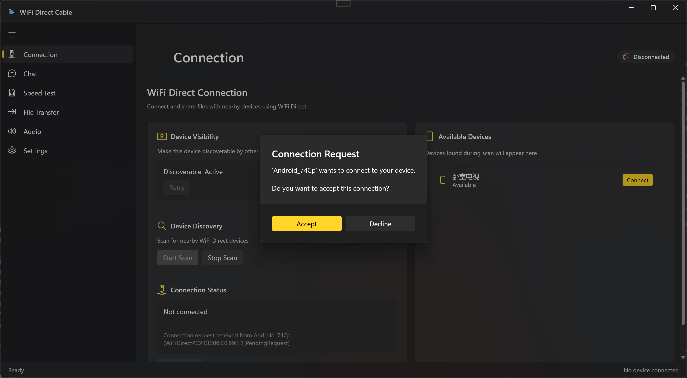
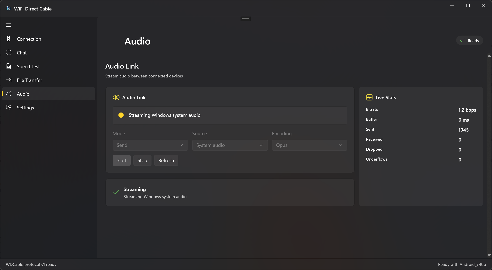
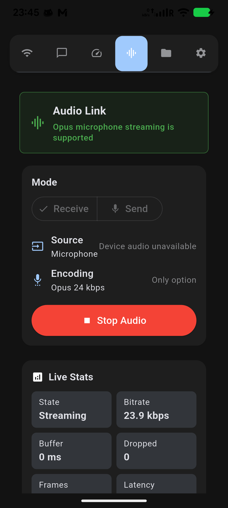

<div align="center">
  

  <h1>WDCable for Windows</h1>

  <p>
    <strong>WiFi Direct Cable (WDCable)</strong> connects Windows and Android devices directly
    for fast file sharing, messaging, speed testing, and audio streaming—without a router,
    hotspot, or internet connection.
  </p>

  <a href="https://apps.microsoft.com/store/detail/9MZQMRHFFJJW?cid=DevShareMCLPCS">
    
  </a>

  <p>Windows 10 version 1809+ and Windows 11 · x64 and ARM64 · Wi-Fi Direct</p>
</div>

<p align="center">
  
</p>

<p align="center">
  <em>Receive and accept connection invitations directly from an Android device.</em>
</p>

## ✨ Features

- **Connect without network infrastructure** — Link nearby devices directly over Wi-Fi Direct, with no router, hotspot, or internet connection required.
- **Transfer files quickly** — Send files between Windows and Android with drag-and-drop support and a clear transfer history.
- **Chat across devices** — Exchange messages with a connected device over the same direct connection.
- **Stream audio with Audio Link** — Send Windows system audio to Android or stream Android microphone audio to Windows using low-latency Opus encoding.
- **Measure connection performance** — Run a built-in speed test to check the quality and throughput of the direct link.
- **Use a native Windows experience** — Work in a modern WinUI 3 interface designed for Windows 10 and Windows 11.

## 📸 Screenshots

<table>
  <tr>
    <td width="50%" align="center">
      
      <br><strong>Connection</strong>
    </td>
    <td width="50%" align="center">
      
      <br><strong>Chat</strong>
    </td>
  </tr>
  <tr>
    <td width="50%" align="center">
      
      <br><strong>Speed Test</strong>
    </td>
    <td width="50%" align="center">
      
      <br><strong>File Transfer</strong>
    </td>
  </tr>
</table>

### Audio Link

<table>
  <tr>
    <td width="68%" align="center" valign="top">
      
      <br><strong>Windows system-audio streaming</strong>
    </td>
    <td width="32%" align="center" valign="top">
      
      <br><strong>Android Audio Link</strong>
    </td>
  </tr>
</table>

## 🔗 How It Works

WDCable uses Wi-Fi Direct to establish a peer-to-peer connection between supported devices. Data travels directly between them instead of passing through a router or the internet.

<p align="center">
  
</p>

## 💻 Requirements

- Windows 10 version 1809 (build 17763) or later, or Windows 11.
- An x64 or ARM64 Windows device.
- A Wi-Fi network adapter and driver that support Wi-Fi Direct.
- A second compatible Windows or Android device for peer-to-peer communication.

## 📱 Android Version

Use [WDCable for Android](https://github.com/jingcjie/WDCable_flutter) to connect an Android device and transfer files, exchange messages, test connection speed, or use Audio Link across platforms.

## 🚀 Getting Started

Install WDCable from the Microsoft Store using the button above, or build it from source.

### Building from Source

1. Clone this repository:

   ```sh
   git clone https://github.com/jingcjie/WDCableWUI.git
   ```

2. Open `WDCableWUI.sln` in Visual Studio.
3. Select the `x64` or `ARM64` platform.
4. Build and run the project.

## 🛠️ Built With

- [.NET 8](https://dotnet.microsoft.com/)
- [Windows App SDK](https://learn.microsoft.com/windows/apps/windows-app-sdk/)
- [WinUI 3](https://learn.microsoft.com/windows/apps/winui/winui3/)
- [Opus](https://opus-codec.org/) audio encoding

## 📄 License

WDCable is licensed under the terms in the [LICENSE](LICENSE) file.
